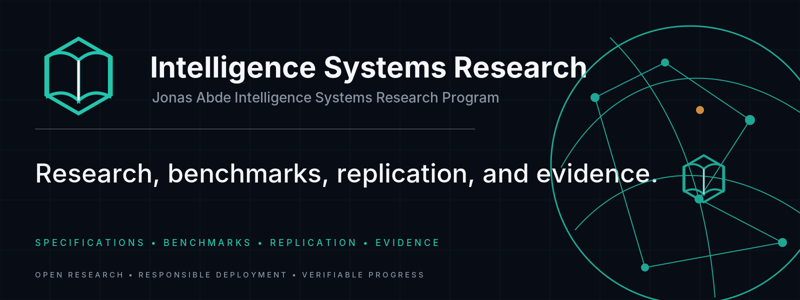

<!-- aftergraph-brand-os:v1.1.0 -->

[](https://scorecard.dev/viewer/?uri=github.com/Aftergraph/intelligence-systems-research)

<p align="center">
  <picture>
    <source media="(prefers-color-scheme: dark)" srcset=".github/assets/github/hero.webp">
    
  </picture>
</p>

# ABDE Research
## Jonas Abde Intelligence Systems Research Program — Q3 2026

**Principal Researcher:** Jonas Abde  
**Program State:** research/engineering phases 1–10 complete; STUDY-011 live confirmatory run executed, analyzed and frozen  
**Defensible Maturity:** **Level C+ / Provisional-D**; blind external reproduction and live human validation remain open  
**Evidence Audit:** `AUDIT-EVID-001` plus frozen STUDY-011 post-execution evidence  
**Snapshot Date:** 11 September 2026  
**License:** Apache 2.0 (Open Specification, Software & Data)

> [!IMPORTANT]
> This repository distinguishes **deterministic/simulated**, **live pilot**,
> **live confirmatory**, **human**, **formal**, and **external-replication**
> evidence. A result in one class is never silently promoted into another.
> STUDY-008 remains a methodological pilot with 2/275 `LIVE_VALID` runs.
> STUDY-011 is now complete and frozen with 470 `LIVE_VALID` records:
> **H1 REVERSED / H2 SUPPORTED / H3 REVERSED**. Earlier “D2 65% / D3 25%
> / D1 10%”, blanket “FCR eliminated”, and human-validation language is not
> current program truth.

---

## Current Research Result

The program investigates the systems boundary between:

> human intent → persistent mission → state → capability composition → delegated authority → resource constraints → execution → assurance → evidence → verified outcome

The current evidence supports a narrower thesis than early program drafts:

- deterministic MISSION-Bench work shows large reliability, authority, recovery and cost effects under controlled fault injection, but those results are **not live-provider population estimates**;
- the frozen live confirmatory STUDY-011 result shows that **assurance invocation (F)** drives the main abstention→action transition;
- **authority + budget tracking (G)** adds a statistically strong marginal effect over F in both provider strata (`p < 0.001`, `h ≈ 2.5`), so **H2 is SUPPORTED**;
- **H1 is REVERSED** because baseline A/C frequently abstained and therefore had FCR near zero;
- **H3 is REVERSED** because retry alone did not overcome abstention;
- live human UX evidence is still **N=0**; GOMS/persona simulation is pipeline/calibration evidence only;
- alternative implementations are currently same-program/in-tree evidence, **not blind external reproduction**;
- external formal/prior-art work, including STEAD, can narrow the novelty claim and is treated as a falsification/overlap input rather than ignored.

The frozen statistical-review disposition is **`SOUND_WITH_HEDGES_REQUIRED`**.

---

## Frozen STUDY-011 Evidence

| Item | Canonical state |
|---|---|
| Dataset | `data/study011_runs/confirmatory/canonical-run-002/` |
| Analysis | `data/study011_runs/confirmatory/canonical-run-002-analysis/` |
| Final summary | `data/study011_runs/confirmatory/canonical-run-002-analysis/FINAL-CONFIRMATORY-SUMMARY.md` |
| Freeze | `STUDY-011-AMENDMENT-011-POST-EXECUTION-FREEZE.md` |
| Valid sample | **470 `LIVE_VALID`** |
| Cell coverage | **8/8 cells ≥58** |
| H1 | **REVERSED** |
| H2 | **SUPPORTED** in both provider strata |
| H3 | **REVERSED** |

The raw log contains checkpoint/resume duplicate `run_id` records. Frozen G7 semantics plus Amendment-010 lineage/fingerprint preference determine the one-observation-per-run analysis set; this is documented reconciliation, not silent deletion.

---

## Evidence-Class Summary

```text
============================================================================================
 RESULT / METRIC                         VALUE / VERDICT              EVIDENCE CLASS
============================================================================================
 MISSION-Bench observed FCR              0.0% in evaluated sample     DETERMINISTIC / SIMULATED
 MISSION-Bench CPVO change               -81.3% in tested cost model  SIMULATION_SUPPORTED
 Human HEVO                              6.6 -> 2.0 turns             GOMS SIMULATION; N=0 HUMANS
 SPEC-001 conformance                     14/14                        DETERMINISTIC IN-TREE
 STUDY-008                                2 / 275 LIVE_VALID           METHODOLOGICAL PILOT
 STUDY-011 canonical sample               470 LIVE_VALID               LIVE CONFIRMATORY
 STUDY-011 H1                             REVERSED                     LIVE CONFIRMATORY
 STUDY-011 H2                             SUPPORTED                    LIVE CONFIRMATORY
 STUDY-011 H3                             REVERSED                     LIVE CONFIRMATORY
 Blind external reproduction              PENDING                      NOT YET SATISFIED
 Live human UX validation                 PENDING                      N=0 HUMANS
============================================================================================
```

---

## Repository Map

### Specification and implementation

- [`SPEC-001-MISSION-CONTRACT-v0.1.md`](SPEC-001-MISSION-CONTRACT-v0.1.md) — candidate mission/system contract.
- `schemas/` — Draft 2020-12 machine-readable schemas.
- `runtime/` — reference runtime and deterministic verification boundaries.
- `assurance/`, `delegation/` — assurance and delegated-authority mechanisms.
- `adapters/` — runtime adapters.
- `validation/`, `external_validation_pack/` — alternate in-tree/same-program implementations and conformance material.
- `conformance/` — normative conformance suite.

### Research studies

- [`STUDY-001-ENGINEERING-STANDARDS-GAP.md`](STUDY-001-ENGINEERING-STANDARDS-GAP.md) — foundational standards/gap analysis.
- [`STUDY-002-JAR-EXP-0001-EMPIRICAL-EVALUATION.md`](STUDY-002-JAR-EXP-0001-EMPIRICAL-EVALUATION.md) — deterministic SWE workload evaluation.
- [`STUDY-003-MISSION-BENCH-ABLATION-AND-ECONOMICS.md`](STUDY-003-MISSION-BENCH-ABLATION-AND-ECONOMICS.md) — MISSION-Bench deterministic/simulated ablation and economics.
- [`STUDY-004-MODEL-COMPATIBILITY-REPORT.md`](STUDY-004-MODEL-COMPATIBILITY-REPORT.md) — model-tier compatibility simulation.
- [`STUDY-006-HCI-PREREGISTRATION.md`](STUDY-006-HCI-PREREGISTRATION.md) — human-study protocol; live humans not yet run.
- [`STUDY-008-LIVE-MISSION-BENCH-RESULTS.md`](STUDY-008-LIVE-MISSION-BENCH-RESULTS.md) — methodological live pilot, 2/275 `LIVE_VALID`.
- [`STUDY-011-LIVE-CROSS-PROVIDER-PREREGISTRATION.md`](STUDY-011-LIVE-CROSS-PROVIDER-PREREGISTRATION.md) — preregistered confirmatory protocol.
- [`STUDY-011-READINESS-REPORT.md`](STUDY-011-READINESS-REPORT.md) — current status: `FINAL_FROZEN`.
- [`STUDY-011-AMENDMENT-011-POST-EXECUTION-FREEZE.md`](STUDY-011-AMENDMENT-011-POST-EXECUTION-FREEZE.md) — frozen post-execution evidence cut.

### Research registries

- `data/claim_registry.csv` — current claim state with evidence scope, sources and `last_verified`.
- `data/claim_evidence_audit.csv` — historical/evidence-level claim audit; preserved rather than rewritten away.
- `data/hypothesis_registry.csv` — current hypothesis state with evidence scope.
- `data/experiment_registry.csv` — study/experiment state; STUDY-008/JAR-EXP-0008 remains `METHODOLOGICAL_PILOT`.
- `data/source_registry.csv`, `data/objection_registry.csv`, `data/decision_log.csv`, `data/open_questions.csv` — provenance and research-control registries.
- `data/publication_artifact_registry.csv` — publication/export status and exact source binding when the registry PR is merged.

### Scientific paper series

Current source papers under `PAPERS/`:

1. `01-FROM-MODELS-TO-MISSIONS-INTELLIGENCE-SYSTEMS-CONTRACT.md`
2. `02-MISSION-BENCH-ABLATION-AND-EMPIRICAL-EVALUATION.md`
3. `03-THE-ECONOMICS-OF-VERIFIED-INTELLIGENT-SYSTEMS.md`
4. `04-ATTENUATED-AUTHORITY-AND-EVIDENCE-GATED-SYSTEMS-ARCHITECTURE.md`
5. `05-FRONTIER-AGENT-BREAKOUT-AND-INSTITUTIONAL-CONTROL.md`

Publication readiness is **not inferred from a filename or old front-matter label**. Use the publication artifact registry/current audit before citing or exporting. Paper 01 requires reconciliation; Papers 02–04 require re-audit; Paper 05 is a disclosed working manuscript, not peer-reviewed external validation.

---

## Verification

```bash
# Full repository tests
pytest -q

# Normative conformance suite
python conformance/runner.py

# Program audit / registry integrity
python cli/mission_cli.py audit

# Inspect the frozen confirmatory summary
cat data/study011_runs/confirmatory/canonical-run-002-analysis/FINAL-CONFIRMATORY-SUMMARY.md
```

Do not re-run the frozen confirmatory protocol and merge the result into STUDY-011 as though it were the same experiment. A new confirmatory question requires a new preregistered evidence cut.

---

## Research Rule

A checked box, merged PR, passing test, model output, paper export or issue closure is not scientific truth by itself. Current claims must remain traceable to their evidence class and exact source. Historical findings remain addressable for provenance, but they cannot silently masquerade as current state.
