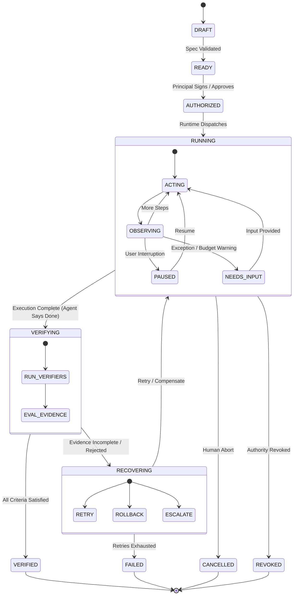
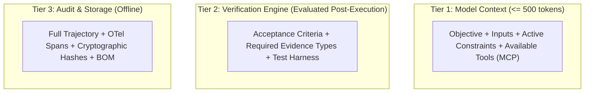

# SPEC-001: Intelligence System Contract Specification v0.1
**Program:** Jonas Abde Intelligence Systems Research Program — Q3 2026  
**Status:** DRAFT NORMATIVE SPECIFICATION — PHASE B  
**Target SDOs:** IEEE P3709 / P3777 Alignment, NIST AI 200-2 Compatibility  
**Author:** Jonas Abde Research Program  
**Date:** 3 September 2026  

---

## 1. Scope and Purpose

This specification defines the machine-readable contract format, execution invariants, state machine, and evidence verification semantics for the **Mission Contract** and the root **Intelligence System Manifest**.

The objective of this specification is **not** to replace established tool-calling protocols (e.g., MCP), agent communication protocols (e.g., A2A), workload identity systems (e.g., SPIFFE), or telemetry standards (e.g., OpenTelemetry GenAI). Rather, it provides the missing **systems-level integration layer** that binds human intent to persistent mission execution, delegated authority, and deterministic outcome verification across heterogeneous models, runtimes, and vendors.

---

## 2. Mathematical System Model

An Intelligent System (IS) instance executing a mission is formally defined as an 8-tuple:

$$\text{IS} = \langle M, S, C, A, B, T, E, V \rangle$$

Where:
1. **$M$ (Mission):** Bounded operational contract consisting of objective $\mathcal{O}$, inputs $\mathcal{I}$, acceptance criteria $\mathcal{K}$, and safety invariants $\Phi$.
2. **$S$ (State):** Multi-tier decoupled state vector $\langle S_{\text{mission}}, S_{\text{world}}, S_{\text{agent}}, S_{\text{runtime}} \rangle$.
3. **$C$ (Capabilities):** Set of resolved tool, skill, and agent capabilities $C = C_{\text{mcp}} \cup C_{\text{skill}} \cup C_{\text{a2a}}$.
4. **$A$ (Authority):** Dynamic permission set granted by principal $P$, subject to purpose $\mathcal{O}$ and expiration $\tau$.
5. **$B$ (Budget):** Resource envelope constraining tokens, currency, wall-clock time, and human interruptions: $B = \langle \text{max\_tokens}, \text{max\_cost}, \text{max\_time}, \text{max\_human} \rangle$.
6. **$T$ (Trajectory):** Append-only causal sequence of events: $T = [e_1, e_2, \dots, e_n]$.
7. **$E$ (Evidence):** Set of cryptographic or deterministic proof artifacts supporting satisfaction of criteria $\mathcal{K}$.
8. **$V$ (Verifier):** Independent evaluation function $V: (M, T, E) \to \{\text{VERIFIED}, \text{REJECTED}, \text{INDETERMINATE}\}$.

---

## 3. Normative Invariants

Any conforming implementation of this specification **MUST** enforce the following five invariants:

1. **Invariant 1 (Non-Equivalence of Completion and Verification):**
   $$\text{Complete}(M) \not\implies \text{Verified}(M)$$
   An agent self-declaring "done" or emitting a final text response transitions the mission to `VERIFYING`, never directly to `VERIFIED`.

2. **Invariant 2 (Evidence-Gated Completion):**
   $$\text{Verified}(M) \iff \forall k \in \mathcal{K}, \exists e \in E : V(k, e) = \text{SATISFIED}$$
   Transition to `VERIFIED` strictly requires qualifying evidence evaluated by an independent verifier.

3. **Invariant 3 (Purpose-Bound Authority Attenuation):**
   $$\forall a \in A_{\text{subagent}}, \quad a \subseteq A_{\text{parent}} \quad \land \quad \text{Purpose}(a) \subseteq \text{Purpose}(A_{\text{parent}})$$
   Sub-delegation must monotonically decrease (attenuate) permissions and cannot exceed parent mission boundaries.

4. **Invariant 4 (Budget Non-Exceedance):**
   $$\text{Cost}(T) \le B_{\text{cost}} \quad \land \quad \text{Tokens}(T) \le B_{\text{tokens}} \quad \land \quad \text{Time}(T) \le B_{\text{time}}$$
   If any budget limit is reached, runtime execution must halt or transition to `NEEDS_INPUT`.

5. **Invariant 5 (State Mutation Traceability):**
   Every mutation to $M$ or $S$ must append a signed or tamper-evident event to $T$ compatible with OpenTelemetry GenAI semantic conventions.

---

## 4. Lifecycle State Machine



### State Definitions:
- **`DRAFT`:** Mission is being composed; schema may be partial.
- **`READY`:** Schema is complete and valid; awaiting authority grant.
- **`AUTHORIZED`:** Delegation token issued by principal with specific budget and capability scope.
- **`RUNNING`:** Active execution loop in runtime.
- **`PAUSED`:** Execution temporarily suspended by human operator.
- **`NEEDS_INPUT`:** Runtime halted due to ambiguous decision, budget limit, or policy tripwire.
- **`VERIFYING`:** Agent declared execution complete; independent verifiers are evaluating evidence against acceptance criteria.
- **`VERIFIED`:** Ground truth verified. Acceptance criteria satisfied by qualifying evidence.
- **`RECOVERING`:** Active failure recovery: retry with feedback, rollback changes, or plan compensation.
- **`FAILED`:** Terminal failure: recovery exhausted or unrecoverable invariant violation.
- **`CANCELLED`:** Terminal cancellation requested by human.
- **`REVOKED`:** Terminal termination due to credential or authority revocation mid-flight.

---

## 5. Attenuated Delegation and Authority Model

Authority is modeled as a portable delegation token derived from **IETF RFC 8693 (OAuth 2.0 Token Exchange)**:

```yaml
delegation:
  id: "del-8921f0"
  principal: "urn:principal:human:jonas"
  delegate: "urn:agent:release-orchestrator-v1"
  purpose: "urn:mission:release-production:v1"
  scope:
    allowed_capabilities:
      - "mcp://github/repo:write"
      - "skill://deploy/kubernetes:apply"
    denied_capabilities:
      - "mcp://github/repo:admin"
      - "mcp://aws/iam:*"
  constraints:
    target_branch: "release/4.8"
    environment: "production"
  budget:
    max_usd: 15.00
    max_tokens: 150000
  valid_from: "2026-09-03T21:00:00Z"
  expires_at: "2026-09-03T23:00:00Z"
  allow_redelegation: true
  max_delegation_depth: 2
```

When `release-orchestrator-v1` spawns a subagent to run tests, the subagent's token must be **attenuated**:
- `scope` must be a strict subset (e.g. only test tool execution).
- `max_delegation_depth` decrements to 1.
- `expires_at` must be $\le$ parent's expiration.

---

## 6. Capability Resolution Protocol

Capabilities are referenced using explicit URI schemes:
1. **`mcp://<server_name>/<tool_name>`:** Invoked via Model Context Protocol JSON-RPC.
2. **`skill://<namespace>/<skill_name>`:** Executed via standard `SKILL.md` procedural bundle.
3. **`a2a://<agent_urn>/<action>`:** Dispatched via Agent-to-Agent protocol using Agent Cards.
4. **`runtime://<builtin_function>`:** Executed by local host environment.

The runtime verifies that every capability requested by an agent is explicitly permitted under the active `delegation.scope` before dispatching.

---

## 7. Evidence and Verification Tiers (NIST AI 200-2 Alignment)

Evidence items must belong to one of four verifiable tiers:

| Tier | Name | Description | Example |
| :--- | :--- | :--- | :--- |
| **Tier 0** | *Agent Self-Assertion* | The agent claims it completed the task in text. | "I have fixed the issue in file X." (Unacceptable for verification) |
| **Tier 1** | *Model Evaluation* | Independent LLM-as-a-Judge inspects diff and logs. | Secondary evaluator prompt scoring compliance. |
| **Tier 2** | *Deterministic Receipt* | Deterministic exit code, unit test pass, lint check, build log. | Pytest exit code 0, GitHub Actions build artifact. |
| **Tier 3** | *Cryptographic Attestation* | Cryptographically signed receipt, C2PA manifest, hardware enclave signature. | Signed webhook from payment processor, signed git commit. |

**Standard Rule:** A mission declaring `assurance.verification.independence: required` requires at least **Tier 2** deterministic evidence or **Tier 3** cryptographic evidence to transition to `VERIFIED`.

---

## 8. Complexity Budget & Progressive Disclosure

To comply with the Ponytail senior developer standard and guarantee compatibility with smaller open-weight models (7B–14B), the mission specification enforces a 3-tier progressive disclosure strategy:



- **Tier 1 (Execution Payload):** Delivered to the agent prompt. Contains only what is needed to plan and act ($\le 500$ tokens).
- **Tier 2 (Verification Payload):** Retained by the runtime verifier. Not included in the agent's action loop until `VERIFYING` phase, avoiding prompt bloat and bias.
- **Tier 3 (Audit Payload):** Appended to storage and emitted via OpenTelemetry GenAI spans. Never loaded into model context during execution.

---
*End of SPEC-001 Specification.*
