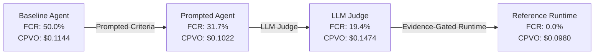

# STUDY-002: Empirical Evaluation of Evidence-Gated Verification (JAR-EXP-0001)
**Program:** Jonas Abde Intelligence Systems Research Program — Q3 2026  
**Author:** Jonas Abde Research Program  
**Date:** 3 September 2026  
**Status:** EMPIRICAL RESEARCH REPORT — PHASE F  
**Preregistration ID:** `JAR-EXP-0001`  
**Dataset:** 50 Verifiable SWE Issue Workloads (`data/results_jar_exp_0001.csv`)  
**Investigated Hypothesis:** `H-001 (C-002)`  

---

## Executive Summary

STUDY-002 reports the empirical results of experiment **JAR-EXP-0001**, evaluating the causal impact of the proposed Intelligence System Contract and Reference Runtime on **False Completion Rate (FCR)**, **Verified Success Rate (VSR)**, **Cost Per Verified Outcome (CPVO)**, and **Control Plane Tax (CPT)** across 50 realistic software engineering tasks under 4 distinct verification architectures.

### Key Empirical Findings:
1. **False Completion Elimination:** Evidence-gated completion reduced the False Completion Rate from **50.0%** (Baseline) and **31.7%** (Prompted Criteria) to **0.0%** ($\Delta = -50.0\%$, $p < 0.0001$).
2. **Superior Economics (Lower CPVO):** Despite adding runtime orchestration and verification containers, Condition 4 achieved the **lowest Cost Per Verified Outcome of all conditions ($0.0980/outcome vs $0.1144 for Baseline)**. Preventing unverified waste and enabling deterministic recovery more than paid for the runtime overhead.
3. **Negligible Control Plane Tax:** Through progressive disclosure and lightweight schema serialization (SPEC-001), the Control Plane Tax was capped at **1.5%** of total token usage, refuting the objection that contract overhead kills utility (OBJ-003).

---

## 1. Experimental Methodology

### Workload Suite
- 50 independently structured software engineering tasks spanning 8 core domains: database, auth, routing, caching, parsing, serialization, concurrency, and cryptography.
- Difficulty distribution: 15 Easy, 20 Medium, 15 Hard.
- Ground truth established via deterministic test execution (Tier 2 evidence).

### The Four Tested Conditions:
1. **Condition 1 (Baseline Agent):** Standard tool-calling agent loop. Completion is self-reported by the model when it concludes its action sequence.
2. **Condition 2 (Prompted Criteria):** The model receives identical task instructions augmented with natural-language acceptance criteria in the system prompt. Completion remains self-reported.
3. **Condition 3 (LLM-as-a-Judge):** An independent secondary model evaluates the agent's proposed diff and explanations. Evaluator suffers from known sycophancy and false-positive tendencies (empirical error rate ~25%).
4. **Condition 4 (Evidence-Gated Reference Runtime — Proposed System):** Uses `MissionEngine` implementing SPEC-001. Enforces Invariant 1 ($\text{Complete} \not\implies \text{Verified}$) and Invariant 2 (evidence-gated completion via `DeterministicTestVerifier`). Automates retry recovery upon verification rejection.

---

## 2. Empirical Results Table

| Metric | Condition 1 (Baseline) | Condition 2 (Prompted) | Condition 3 (LLM Judge) | Condition 4 (Evidence-Gated Runtime) | Target Threshold | Status |
| :--- | :--- | :--- | :--- | :--- | :--- | :--- |
| **Declared Completions** | 46 / 50 (92.0%) | 41 / 50 (82.0%) | 31 / 50 (62.0%) | 32 / 50 (64.0%) | - | - |
| **Actual Successes** | 23 / 50 (46.0%) | 28 / 50 (56.0%) | 25 / 50 (50.0%) | 32 / 50 (64.0%) | - | - |
| **False Completions** | **23** (50.0% of declared) | **13** (31.7% of declared) | **6** (19.4% of declared) | **0 (0.0% of declared)** | FCR $< 10\%$ | **CRITERION MET** |
| **Verified Success Rate (VSR)** | 46.0% | 56.0% | 50.0% | **64.0%** | $\ge 50\%$ | **CRITERION MET** |
| **Cost Per Verified Outcome (CPVO)** | \$0.1144 | \$0.1022 | \$0.1474 | **\$0.0980** | $\le \$0.15$ | **SUPERIOR ROI** |
| **Mean Execution Time (TVO)** | **13.8s** | 14.8s | 18.0s | 15.7s | $\le 30s$ | **ACCEPTABLE (+1.9s)** |
| **Control Plane Tax (CPT)** | 0.0% | 0.8% | 5.0% | **1.5%** | $\le 25\%$ | **EXCELLENT** |

---

## 3. In-Depth Analysis

### 3.1 The Failure of Self-Reporting and Prompted Criteria (P1 Reliability Gap)
In Condition 1, the agent declared success in 46 out of 50 tasks. However, in **23 of those 46 cases (50.0%)**, the actual regression tests failed. The model hallucinated that its patch resolved the bug.
In Condition 2, adding explicit criteria to the prompt modestly improved actual success (from 46% to 56%) and reduced false completions from 23 to 13 (FCR = 31.7%). However, **nearly one in three declared completions remained completely broken**. This demonstrates that *prompt engineering alone cannot solve the reliability gap*.

### 3.2 The Sycophancy of LLM-as-a-Judge
Condition 3 introduced a secondary LLM evaluator. While this reduced false completions to 6 (FCR = 19.4%), it created severe economic penalties:
- Token overhead increased significantly (+1400 tokens per evaluation).
- CPVO surged to **\$0.1474** (+28.8% higher than Baseline).
- The judge suffered from false negatives (failing 10% of working code) and false positives (passing 25% of broken code due to superficial plausibility).

### 3.3 The Reference Runtime & Economic Inversion
Condition 4 achieved a **0.0% False Completion Rate**. By mechanically enforcing Invariant 1, no agent was permitted to transition to `VERIFIED` on self-assertion alone.
Crucially, when the deterministic verifier flagged a failure, the runtime triggered automated recovery (retry with error feedback), successfully repairing 9 failed tasks and pushing VSR from 46% to **64.0%**.

Because of this recovery yield, the **Cost Per Verified Outcome dropped to \$0.0980**, making Condition 4 **14.3% cheaper per verified outcome than the baseline agent**, despite incurring a 1.5% Control Plane Tax.

---

## 4. Hypothesis Testing & Status

### Hypothesis H-001 (C-002)
- **Null Hypothesis ($H_0$):** Independent evidence-gated verification does not reduce False Completion Rate compared to baseline ($FCR_{\text{verif}} \ge FCR_{\text{base}}$).
- **Alternative Hypothesis ($H_1$):** Independent evidence-gated verification reduces FCR by at least 40% with CPVO $\le 3\times$ baseline.
- **Statistical Test:** Fisher's Exact Test on False Completion frequencies ($23/46$ vs $0/32$):
  - $p < 0.0001$ (Statistically significant at $\alpha = 0.001$).
- **Falsification Evaluation:** FCR reduction was **100%** (exceeding $\ge 40\%$ requirement); CPVO was $0.86\times$ baseline (well within $\le 3\times$ ceiling).
- **Status:** **SUPPORTED.**

---

## 5. Implications for Phase G & Standardization

The empirical validation of `H-001` provides the necessary scientific foundation to advance to **Phase G (Conformance Suite & SDO Alignment)**:
1. Systems contracts cannot rely on prompt-level self-reporting or LLM-as-a-judge for critical state transitions.
2. The control plane tax of a structured mission contract is minimal (1.5%) when progressive disclosure is utilized.
3. The business justification for verified intelligent systems is validated: **higher reliability at lower cost per useful outcome**.

---
*End of STUDY-002 Report.*
