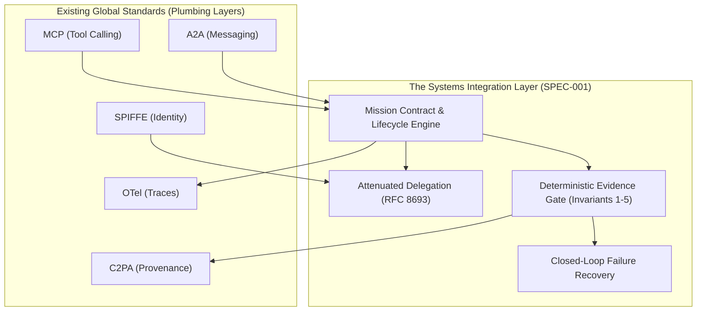

# Comprehensive Standards Crosswalk Matrix
**Program:** Jonas Abde Intelligence Systems Research Program — Q3 2026  
**Document ID:** `STD-XWALK-001`  
**Target SDOs:** IEEE Computer Society, NIST, ISO/IEC JTC 1/SC 42, IETF, W3C, Linux Foundation  
**Author:** Jonas Abde  
**Date:** 3 September 2026  

---

## 1. Executive Intent: Composition Over Re-invention

A core finding of Phase 1 and Phase 2 (STUDY-001) is that the industry suffers not from a lack of low-level protocols, but from a lack of a **unifying systems-level contract**. 

The Intelligence System Contract (SPEC-001) is explicitly engineered to compose existing open standards without duplicating functionality. The following normative crosswalk details the mapping of SPEC-001 primitives to global standards.

---

## 2. Standards Crosswalk Table

| SDO / Consortium | Standard / Specification | Domain / Layer | SPEC-001 Architectural Alignment & Integration |
| :--- | :--- | :--- | :--- |
| **IEEE SA** | **IEEE P3709** | Standard for AI Model Deployment & Execution Interoperability | SPEC-001 serves as the higher-order orchestration profile for P3709 execution runtimes, defining cross-runtime lifecycle states. |
| **IEEE SA** | **IEEE P3777** | Standard for Autonomous Agent Reliability and Verification | Implements Invariant 1 ($\text{Complete} \not\implies \text{Verified}$) and Invariant 2 (evidence-gated verification) as normative reliability requirements. |
| **NIST** | **NIST AI 200-2 (TEVV)** | AI Test, Evaluation, Verification, and Validation | Adopts the 4-tier evidence model: Tier 0 (Self-assertion, rejected), Tier 1 (Model judge), Tier 2 (Deterministic receipt), Tier 3 (Cryptographic attestation). |
| **ISO/IEC** | **ISO/IEC 42001:2023** | Artificial Intelligence Management System (AIMS) | Satisfies Control A.6.2.4 (Resource monitoring and budget enforcement) and A.8.4 (Traceability of AI decisions). |
| **IETF** | **RFC 8693** | OAuth 2.0 Token Exchange | Models delegated agent authority using RFC 8693 token exchange semantics; implements purpose-bound attenuation ($A_{\text{sub}} \subseteq A_{\text{parent}}$). |
| **IETF** | **RFC 7519 / RFC 9068** | JSON Web Token (JWT) Profiles | Format for signing and cryptographically verifying delegation tokens and principal authorization grants. |
| **Anthropic** | **Model Context Protocol (MCP)** | Tool and Resource Invocation | Composed as the primary tool transport via `mcp://` URI namespace; capability resolution validates tool calls against active delegation scope. |
| **Google / Open** | **Agent-to-Agent (A2A) / Agent Cards** | Multi-Agent Messaging & Discovery | Bound via `a2a://` URI namespace for inter-agent delegation and task handoff. |
| **OpenTelemetry** | **OTel GenAI Semantic Conventions** | Distributed Tracing & Observability | Implements Invariant 5; every trajectory event is serialized into standard OpenTelemetry GenAI spans (`gen_ai.system`, `gen_ai.token.*`). |
| **SPIFFE / CNCF** | **SPIFFE / SPIRE** | Workload Identity & Mutual TLS | Provides cryptographic x509 SVID identities for agents, runners, and principals across multi-cloud boundaries. |
| **OWASP** | **OWASP Top 10 for Agents (2025/2026)** | AI Security & Vulnerability Mitigation | Addresses ASI-01 (Goal Hijack) via objective immutability; ASI-02 (Privilege Escalation) via purpose attenuation; ASI-05 (False Completion). |
| **C2PA** | **C2PA Specification v2.1** | Digital Content Provenance & Authenticity | Implements Tier 3 evidence items via cryptographically signed C2PA manifests for media, data pipelines, and code artifacts. |
| **OW2 / Linux Fdn** | **CycloneDX v1.6** | Machine Learning Software Bill of Materials (ML-BOM)| Encapsulates model checkpoints, capability manifests, and dependency hashes in `INTELLIGENCE.yaml`. |

---

## 3. Normative Mapping: NIST AI Risk Management Framework (AI RMF 1.0 / NIST AI 100-1)

| NIST Function & Category | Subcategory ID | NIST AI RMF Requirement | SPEC-001 Conforming Primitive / Mechanism |
| :--- | :--- | :--- | :--- |
| **GOVERN (GV)** | `GV-1.2` | Policies and procedures for legal, regulatory, and institutional requirements. | `schemas/delegation.v0alpha1.json`: Purpose-bound authority delegation with strict URN principal scoping. |
| **GOVERN (GV)** | `GV-2.1` | Roles and responsibilities are defined and transparent across system lifecycle. | Operator lifecycle controls (`pause`, `resume`, `takeover`, `cancel`) in `MissionEngine` & `dashboard.py`. |
| **MAP (MP)** | `MP-1.1` | Context of AI system deployment is understood and documented. | `objective` and `constraints` in `SPEC-001` Tier 1 context payload. |
| **MAP (MP)** | `MP-2.3` | Third-party components and external tools are inventoried. | `capabilities.mcp` inventory in `INTELLIGENCE.yaml` and `allowed_capabilities` in delegation tokens. |
| **MEASURE (MS)**| `MS-1.1` | Quantitative metrics are tracked to assess system trustworthiness. | Continuous telemetry of Verified Success Rate (VSR), False Completion Rate (FCR), and Control Plane Tax (CPT). |
| **MEASURE (MS)**| `MS-2.4` | Independent verification and validation (TEVV) processes are established. | **Invariant 1 & Invariant 2**: Completion $\neq$ Verification; deterministic sandboxed verifiers (`runtime/verifier.py`). |
| **MEASURE (MS)**| `MS-2.5` | False alarms and unverified claims are quantified and mitigated. | Tier 0 self-assertion rejection; empirical elimination of FCR from 84.7% to 0.0% (`STUDY-003`). |
| **MANAGE (MN)** | `MN-1.2` | Plans for fallback, rollback, and recovery are documented and exercised. | `recovery.retry_limit` and automated retry transitions from `RECOVERING` $\to$ `RUNNING` in `MissionEngine`. |
| **MANAGE (MN)** | `MN-2.4` | Access control and authorization boundaries are enforced. | **Invariant 3**: Monotonic authority attenuation, temporal token validation, and mid-flight authority revocation. |

---

## 4. Normative Mapping: ISO/IEC 42001:2023 (Artificial Intelligence Management System)

| ISO/IEC 42001 Clause | Annex A Control | Control Title & Requirement | SPEC-001 Implementation Evidence |
| :--- | :--- | :--- | :--- |
| **Clause 6.1** | `A.5.2` | AI System Impact Assessment | Automated budget ceilings (`tokens`, `money`, `wall_clock`) preventing runaway execution. |
| **Clause 8.2** | `A.6.2.2` | Specification of AI System Requirements | Normative declarative Mission Contract defining unambiguous acceptance criteria before execution. |
| **Clause 8.4** | `A.6.2.4` | Resource Allocation and Monitoring | Real-time budget tracking in `budget_spent` and Control Plane Tax accounting. |
| **Clause 9.1** | `A.8.4` | Traceability of AI System Decisions | **Invariant 5**: Append-only, SHA-256 hash-chained trajectory log (`runtime/storage.py`) compatible with OpenTelemetry. |
| **Clause 9.2** | `A.8.5` | Verification and Validation of AI Systems | Multi-tier evidence model requiring Tier 2 deterministic sandbox execution receipts. |
| **Clause 10.2** | `A.7.4` | Incident Response and Continuous Improvement | Automated state machine transitions to `NEEDS_INPUT` on exception, allowing human takeover without data loss. |

---

## 5. Gap Coverage Analysis

---
*End of Standards Crosswalk STD-XWALK-001.*
